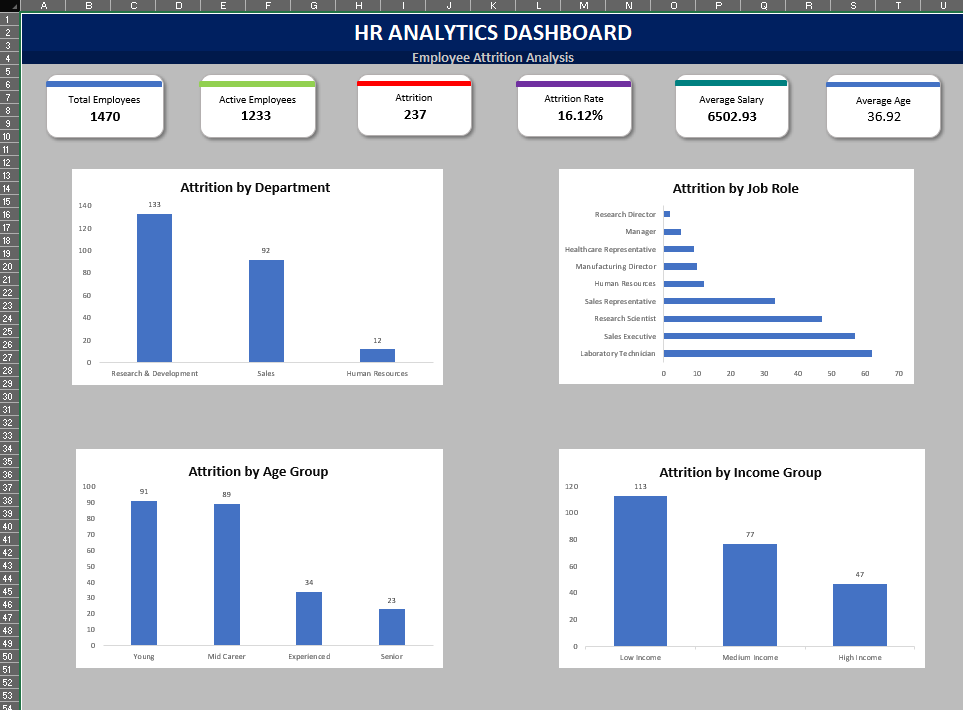

# HR-Analytics-Dashboard

## 📌 Project Overview

This project analyzes employee attrition patterns using the IBM HR Analytics dataset. The goal is to identify key factors contributing to employee turnover and provide actionable recommendations to improve workforce retention.

The dashboard was developed entirely in **Microsoft Excel** using Pivot Tables, Pivot Charts, KPI Cards, Slicers, and interactive dashboard design techniques.

---

## 📊 Dashboard Preview

---

## 🎯 Project Objectives

* Analyze employee attrition trends.
* Identify departments and job roles with the highest turnover.
* Examine the impact of age, income, and overtime on attrition.
* Generate business recommendations based on data-driven insights.
* Create an interactive Excel dashboard for HR decision-making.

---

## 📁 Dataset Information

| Metric           | Value  |
| ---------------- | ------ |
| Total Employees  | 1,470  |
| Active Employees | 1,233  |
| Attrition Count  | 237    |
| Attrition Rate   | 16.12% |
| Departments      | 3      |
| Job Roles        | 9      |

---

## 🛠️ Tools & Features Used

* Microsoft Excel
* Data Cleaning
* Pivot Tables
* Pivot Charts
* KPI Cards
* Slicers
* Dashboard Design
* Business Analytics

---

## 📈 Dashboard KPIs

The dashboard tracks the following key metrics:

* Total Employees
* Active Employees
* Attrition Count
* Attrition Rate
* Average Monthly Salary
* Average Employee Age

---

## 🔍 Analysis Performed

### 1. Attrition by Department

Analyzed employee turnover across departments to identify areas with the highest attrition.

### 2. Attrition by Job Role

Identified job roles contributing most to employee turnover.

### 3. Attrition by Age Group

Examined attrition trends among different employee age segments.

### 4. Attrition by Income Group

Studied the relationship between employee income levels and attrition.

### 5. Overtime Impact

Compared attrition rates between employees who worked overtime and those who did not.

---

## 💡 Key Insights

* Research & Development recorded the highest attrition (**133 employees**).
* Laboratory Technicians experienced the highest turnover (**62 employees**).
* Young employees showed the highest attrition (**91 employees**).
* Low-income employees represented the largest attrition group (**113 employees**).
* Employees working overtime accounted for **54% of total attrition**.
* Young and low-income employees were identified as the highest-risk employee segment.

---

## 🚀 Business Recommendations

* Reduce excessive overtime workload.
* Improve retention programs for Laboratory Technicians.
* Review compensation strategies for lower-income employees.
* Strengthen engagement and career development initiatives for younger employees.
* Implement targeted retention plans for high-risk employee groups.

---

## 📌 Project Outcome

The dashboard provides HR teams and management with a clear understanding of employee attrition patterns, enabling data-driven decisions to improve employee retention and workforce satisfaction.

---

## 👨‍💻 Skills Demonstrated

* Data Cleaning & Preparation
* Data Analysis
* Business Intelligence
* Dashboard Design
* HR Analytics
* KPI Development
* Data Visualization
* Interactive Reporting
